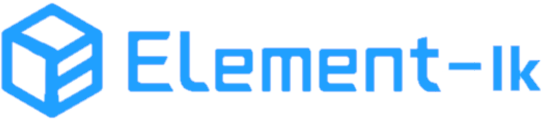
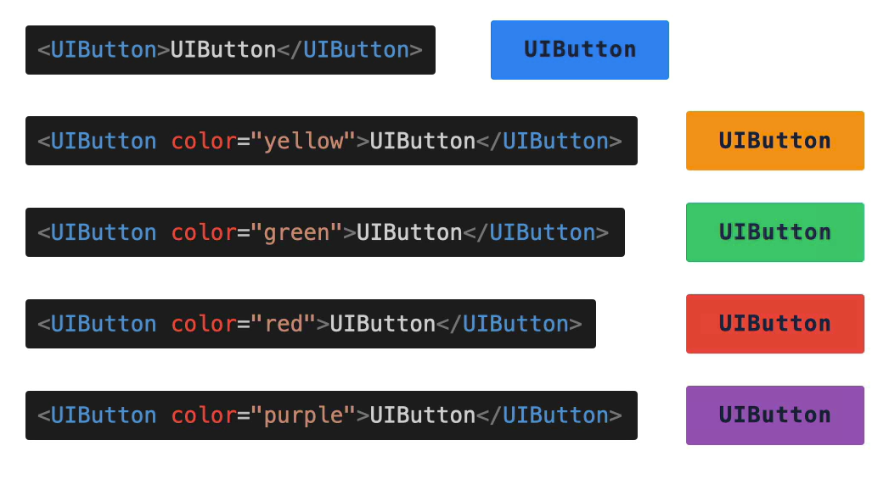
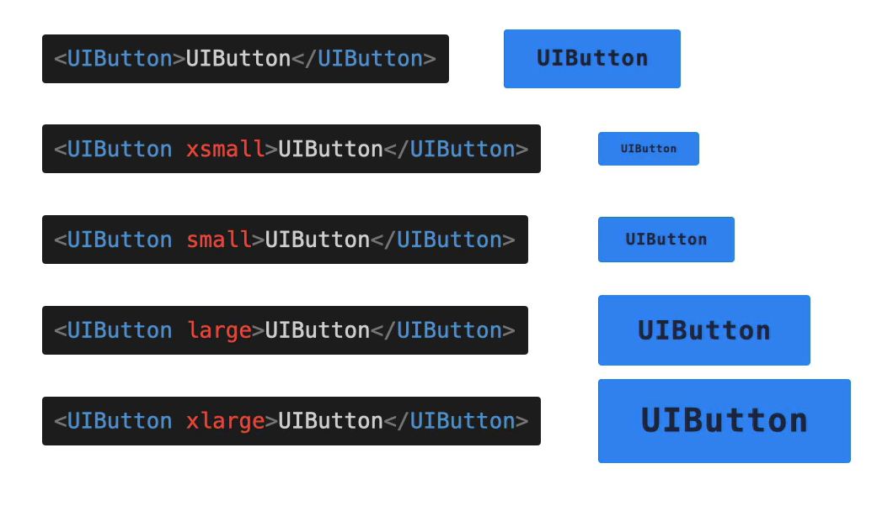
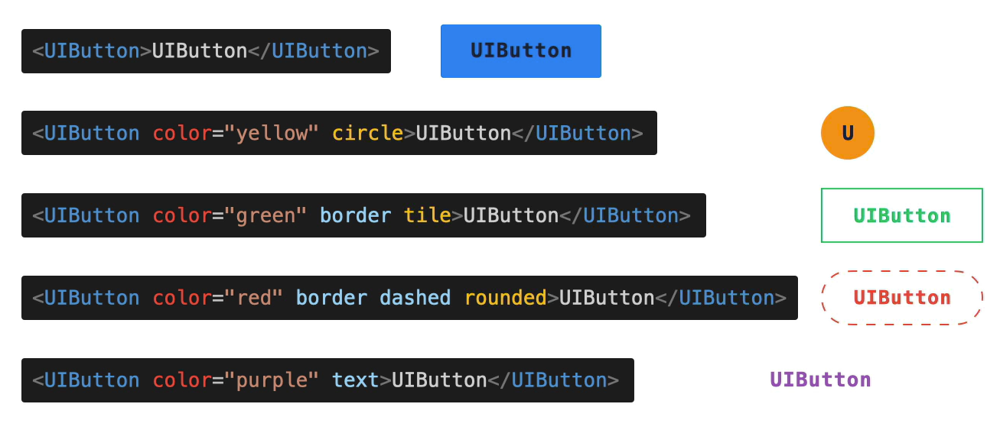

<p align="center">
  
</p>

<p align="center">
  <a href="https://travis-ci.org/ElemeFE/element">
    
  </a>
  <a href="https://coveralls.io/github/ElemeFE/element?branch=master">
    
  </a>
  <a href="https://cdnjs.com/libraries/element-ui">
    
  </a>
  <a href="https://www.npmjs.org/package/element-ui">
    
  </a>
  <a href="https://npmcharts.com/compare/element-ui?minimal=true">
    
  </a>
  <br>
  <a href="http://img.badgesize.io/https://unpkg.com/element-ui/lib/index.js?compression=gzip&label=gzip%20size:%20JS">
    
  </a>
  <a href="http://img.badgesize.io/https://unpkg.com/element-ui/lib/theme-chalk/index.css?compression=gzip&label=gzip%20size:%20CSS">
    
  </a>
  <a href="#backers">
    
  </a>
  <a href="#sponsors">
    
  </a>
  <a href="LICENSE">
    
  </a>
</p>

# Element-lk UI 

Hi! 首先感谢你使用 Element-lk UI。

Element-lk UI 是一套为开发者、设计师和产品经理准备的开源组件库，旨在快速搭建页面。它基于 Vue 2.0 开发，并提供了配套的设计资源，充分满足可定制化的需求。

Element-lk UI 的成长离不开大家的支持，如果你愿意为 Element-lk UI 贡献代码或提供建议，请阅读以下内容。

## 封装插件计划
* `button`
* `input`
* `image`
* `checkbox`
* `radio`
* `select`
* `badeg`
* `card`
* `form`
* `form-item`
* `message`
* `alert`

## 插件样式改造
* **`颜色`**


* **`大小`**


* **`形态`**


## 安装使用
```shell
npm install element-lk-ui -S
```

## main.js 按需引入
``` javascript
import Vue from 'vue'
import Element from 'element-lk-ui'

Vue.use(Element)

import {
  Select,
  Button
  // ...
} from 'element-lk-ui'

Vue.component(Select.name, Select)
Vue.component(Button.name, Button)
```

## Issue 规范
- issue 仅用于提交 Bug 或 Feature 以及设计相关的内容，其它内容可能会被直接关闭。如果你在使用时产生了疑问，请到 Slack 或 [Gitter](https://github.com/lookwe/element-lk-ui.git) 里咨询。

- 在提交 issue 之前，请搜索相关内容是否已被提出。

- 请说明 Element-lk UI 和 Vue 的版本号，并提供操作系统和浏览器信息。推荐使用 [JSFiddle](https://jsfiddle.net/) 生成在线 demo，这能够更直观地重现问题。


## 开发人员-环境搭建
首先你需要 Node.js 4+，yarn 和 npm 3+。注意：我们使用 yarn 进行依赖版本的锁定，所以请不要使用 `npm install` 安装依赖。
```shell
git clone git@github.com:lookwe/element-lk-ui.git
npm run dev

# open http://localhost:8080
```

打包代码：
```shell
npm run dist
```

## 组件开发规范
- 通过 `make new` 创建组件目录结构，包含测试代码、入口文件、文档
- 如果包含父子组件，需要更改目录结构，参考 `Button`
- 组件内如果依赖了其他组件，需要在当前组件内引入，参考 `Select`

## 加入讨论小组

使用QQ扫描二维码加入讨论群:

